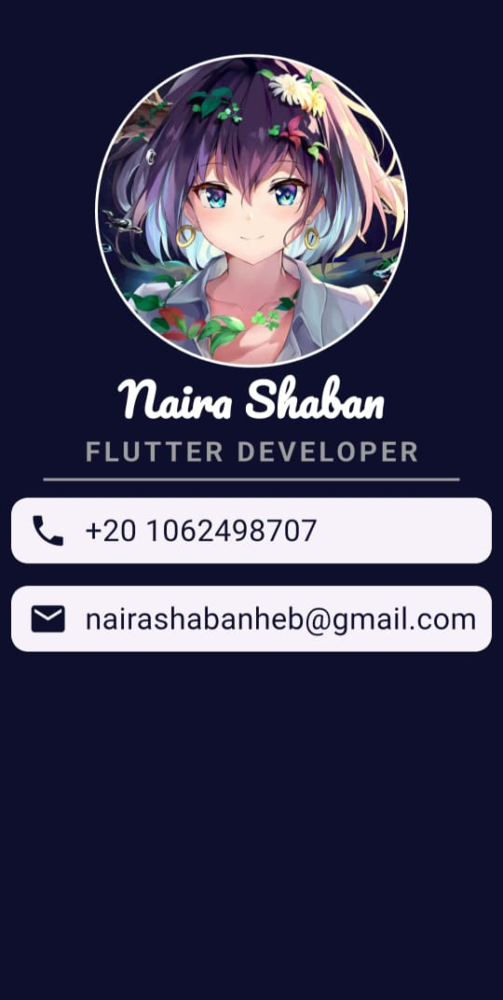

# Flutter Business Card App

A clean and fully responsive personal business card application built using **Flutter**.  
This app showcases a developer's profile with name, job title, contact information, and a profile picture.  
Perfect for building a digital presence or using as a developer portfolio screen.

---

## ✨ Features

- 👤 Circular profile image display
- 📝 Name and profession shown with custom fonts
- 📞 Phone number and 📧 email displayed using styled cards
- 🧱 Modular structure using reusable widgets
- 💡 Fully responsive layout for all screen sizes
- 🎨 Custom fonts and consistent color theme

---

## 📸 Screenshot Preview

| Preview 1 |
|-----------|
|  |

---

## ⚙️ Installation

To run this project on your local machine:

1. **Clone the Repository**

```bash
git clone https://github.com/yourusername/business-card-app.git
